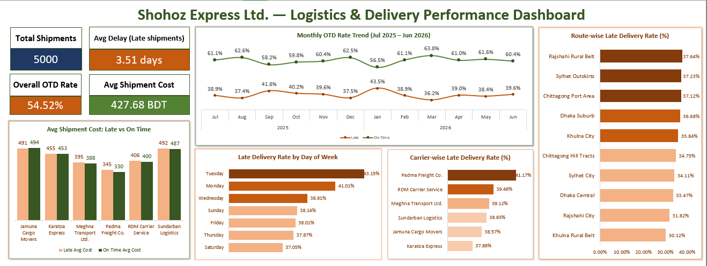

# 📦 Logistics & Delivery Performance Analysis
### Shohoz Express Ltd. | Excel Analytics Project

---

## 📌 Project Overview

This project is a end-to-end logistics analytics case study built entirely in **Microsoft Excel**, designed to showcase advanced Excel skills including Power Query, Power Pivot, DAX, PivotTables, and interactive dashboard design.

**Company:** Shohoz Express Ltd. *(fictional)*

**Domain:** Supply Chain & Logistics

**Analysis Period:** July 2025 – June 2026

**Dataset:** 5,000 shipments across 5 regions, 10 routes, and 6 carriers

---

## ❓ Business Problem

> Shohoz Express Ltd. has seen a rise in customer complaints and a decline in On-Time Delivery (OTD) rate over the past 12 months. Management needs to identify **where, why, and when** delivery performance is failing — and which specific carriers, regions, or routes should be targeted for immediate improvement.

---

## 🎯 Analysis Scope

| # | Analysis | Key Question |
|---|---|---|
| 1 | OTD Rate Trend | How has on-time delivery changed month over month? |
| 2 | Carrier Performance | Which carrier has the worst delivery reliability? |
| 3 | Region & Route Analysis | Which regions and routes experience the most delays? |
| 4 | Delay vs Cost | Does a late delivery cost more? |
| 5 | Day-of-Week Pattern | Are delays concentrated on specific days of the week? |
| 6 | Delay Root Cause | What are the most common reasons for delays? |

---

## 🗂️ Repository Structure

```
shohoz-express-logistics/
│
├── data/
│   ├── raw/                        # Intentionally messy raw datasets
│   │   ├── Shipments_raw.xlsx
│   │   ├── Carriers_raw.xlsx
│   │   └── Routes_raw.xlsx
│   └── clean/                      # Cleaned datasets
│       ├── Shipments.xlsx
│       ├── Carriers.xlsx
│       └── Routes.xlsx
│
├── docs/
│   ├── 01_project_brief.md         # Business problem & scope
│   ├── 02_dataset_structure.md     # Table design & relationships
│   ├── 03_data_issue_log.md            # Pre-cleaning data quality audit
│   ├── 04_data_cleaning_log.md     # Step-by-step cleaning documentation
│   ├── 05_insight_report.md        # Key findings & recommendations
│
├── assets/
│   └── dashboard.png               # Dashboard screenshot
│
└── Shohoz_Express_Logistics.xlsx   # Main workbook (Data Model + Analysis + Dashboard)
```

---

## 🛠️ Tools & Techniques

| Tool / Feature | Purpose |
|---|---|
| **Excel Formulas & Built-in Tools** | Data cleaning — date standardization, duplicate removal, missing value handling, type conversion (TEXT, DATE, IF, ABS, TRIM, PROPER, Find & Replace) |
| **Power Pivot / Data Model** | Relational modeling — 3-table star schema (Shipments ↔ Carriers ↔ Routes) |
| **DAX Measures** | Calculated KPIs — Late %, used across all PivotTables |
| **Calculated Columns** | Delay_Days, OTD_Flag, Cost_per_KM |
| **PivotTables** | Multi-dimensional analysis across carrier, region, route, and time |
| **Excel Charts** | Bar charts, line charts — custom color gradients for visual ranking |
| **Dashboard** | Single-page executive dashboard with 4 KPI cards and 5 charts |

---

## 📊 Dashboard Preview

<p align="center">
  
</p>

---

## 🧹 Data Cleaning Highlights

The raw dataset was intentionally messy to simulate real-world operational data. **21 data quality issues** were identified and resolved across 3 tables.

Key issues handled:
- **5 mixed date formats** in the same column → standardized to `YYYY-MM-DD`
- **Logical vs. true missing values** in `Delay_Reason` → classified as `None`, `Missing Reason`, or `Review Required`
- **3 inconsistent Carrier_ID formats** → standardized to `C-0X`
- **Negative Shipment_Cost values** → corrected using `ABS()` function
- **Typos in categorical values** → corrected via Find & Replace

Full cleaning documentation: [`data_cleaning`](docs/04_data_cleaning_log.md)

---

## 📊 Key Findings

- 📉 Overall OTD Rate: **54.52%** — critically below the 85%+ industry benchmark
- 🚨 Worst carrier: **Padma Freight Co.** — 41.17% late rate + highest cost penalty on delays
- 🗺️ Worst region: **Chittagong** (36.00%) | Worst route: **Rajshahi Rural Belt** (37.64%)
- 📅 Worst days: **Tuesday (43.15%)** and **Monday (41.01%)** — week-start backlog effect
- 💰 Delay and cost are **weakly correlated** — delay is a service quality issue, not a cost driver

---

## ✅ Recommendations

1. **Review Padma Freight Co. contract** — SLA renegotiation or partial route reallocation to Karatoa Express
2. **Strengthen rural route coverage** — dedicated carriers and route-specific SLAs for top 3 worst routes
3. **Redistribute Monday–Tuesday shipment load** — increase Friday/Saturday processing to reduce week-start backlog

Full findings: [`details_report`](docs/05_insight_report.md)

---

## 👩‍💻 Author

**Maksuda Akter**

Junior Data Analyst | Supply Chain & Logistics Domain

[GitHub](https://github.com/quietwithsuborno) · 

[LinkedIn](https://www.linkedin.com/in/maksuda-akter-suborno-9957573ab/)
